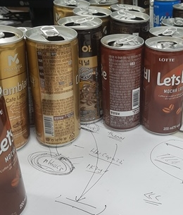

# matlab_graphcut_seam_finder
Slow, Made for practice. Assuming that warping already done, find the seam between the images of overlapping regions.

## Find seam between two image's overlapping region

### Example
#### First image

#### Second image

#### Find seam, draw mask

#### Merge, draw seam on merged image

